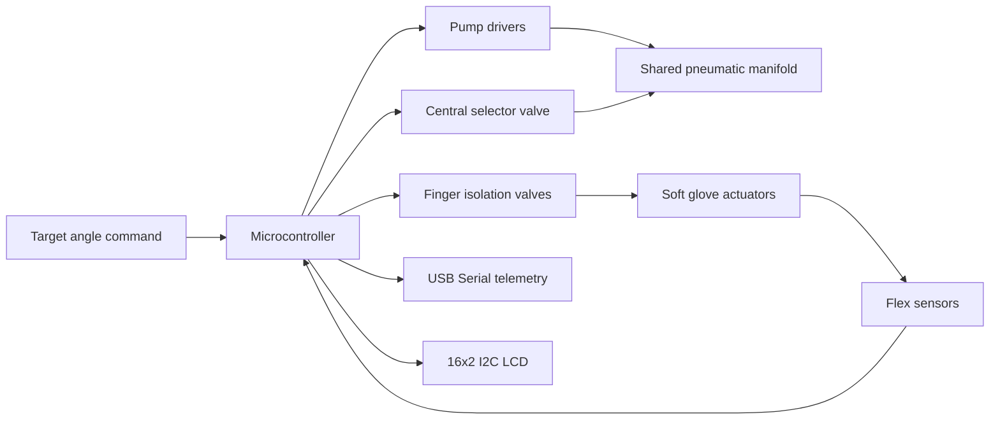

# Architecture

## High-level system



---

## Hardware modules

| Module | Role |
|---|---|
| Microcontroller | Reads sensors, computes control command, drives outputs |
| Flex sensors | Estimate finger bending angle |
| Pump drivers | Drive pressure and vacuum pump channels |
| Central selector valve | Selects pressure or vacuum path for the shared manifold |
| Finger valves | Open or isolate each finger channel |
| LCD | Local status display |
| USB Serial | Commands, CSV telemetry, debugging |
| Optional IMU | Extra motion data when connected |

---

## Minimal controller data flow

```text
1. Read five flex sensors.
2. Convert each raw reading into an angle estimate.
3. Compute the average glove angle.
4. Compare average angle with target angle.
5. Apply proportional control.
6. Select pressure, vacuum, or hold mode.
7. Update pump PWM and valve states.
8. Stream telemetry.
```

---

## Firmware style

The minimal public baseline is deliberately simple:

- no Wi-Fi
- no WebSocket dashboard
- no SD card logging
- no FreeRTOS task split
- no PID or PI loop
- no large fault framework

The richer private controller lines use a more structured firmware style with scheduler, state model, logging, and dashboard support. This repository documents the public-safe architecture without dumping the full development branch.

---

## Why this architecture is useful

The architecture separates three problems that are often mixed together:

1. **Sensing:** estimate finger position.
2. **Control:** decide pressure, vacuum, or hold.
3. **Actuation:** command pumps and valves safely during bench tests.

That separation makes the system easier to debug, explain, and extend.
